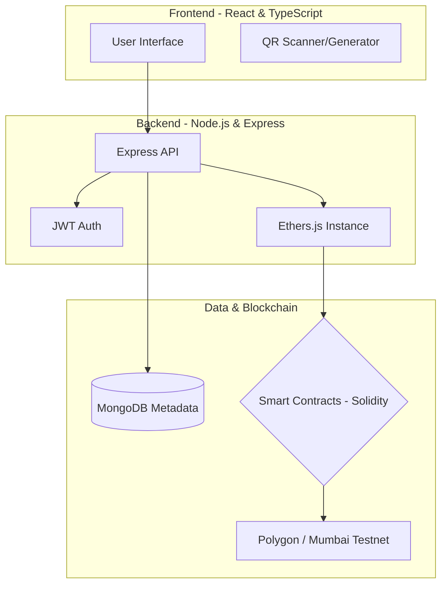
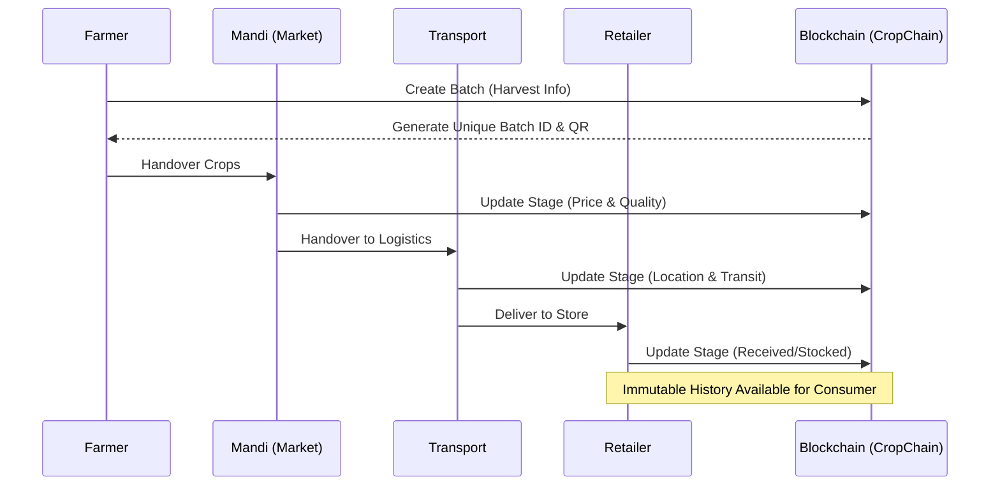

# CropChain - Blockchain Crop Supply Chain Tracker

  <p align="center">
    
    
    
  </p>
  
CropChain is a comprehensive full-stack web application that enables transparent tracking of crop supply chains using blockchain technology. From farm to fork, every step in the supply chain is recorded immutably, providing complete traceability and building trust between all stakeholders.

---

## 🌟 Features

### Core Functionality
- **Complete Supply Chain Tracking**: Track crops through all stages - Farmer → Mandi (Market) → Transport → Retailer
- **Blockchain Integration**: Immutable record keeping using Ethereum/Polygon smart contracts
- **QR Code Generation**: Unique QR codes for each batch enabling instant verification
- **Multi-Role Support**: Different interfaces for farmers, markets, transporters, and retailers
- **Admin Dashboard**: Comprehensive monitoring and analytics for supply chain managers
- **AI-Powered Assistant**: Intelligent chatbot for crop tracking support and stakeholder guidance
- **Offline-First Architecture**: Work without internet - data syncs automatically when online

### User Experience
- **Beautiful, Modern UI**: Apple-level design aesthetics with smooth animations
- **Responsive Design**: Optimized for mobile, tablet, and desktop devices
- **Real-time Timeline**: Visual supply chain journey with status indicators
- **QR Code Scanner**: Simulate scanning QR codes for batch tracking
- **Search & Filter**: Easy batch lookup and filtering capabilities
- **Conversational AI**: Natural language interface for system guidance and batch queries
- **Offline Mode**: Create batches and updates without internet connectivity
- **Auto-Sync**: Changes automatically sync to blockchain when connection restored

---

## 🏗️ Architecture

### Frontend (React + TypeScript)
- **Framework**: React 18 with TypeScript
- **Styling**: Tailwind CSS with custom design system
- **Routing**: React Router for navigation
- **Icons**: Lucide React for consistent iconography
- **State Management**: React hooks and context

### Backend (Node.js + Express)
- **Runtime**: Node.js with Express framework
- **Blockchain**: Ethers.js for smart contract interaction
- **QR Codes**: QRCode library for batch QR generation
- **Database**: MongoDB for metadata storage
- **Authentication**: JWT-based auth system
- **AI Integration**: OpenAI GPT-4o mini for intelligent assistance

### Smart Contracts (Solidity)
- **Platform**: Ethereum/Polygon compatible
- **Language**: Solidity ^0.8.19
- **Features**: Batch creation, supply chain updates, access control
- **Security**: Role-based permissions and data validation

---

## 🚀 Quick Start

### Prerequisites
- Node.js (v14+)
- npm or yarn
- MetaMask wallet
- Infura/Alchemy account (for blockchain)
- MongoDB (for production)

### Installation

1. **Clone the repository**
   ```bash
   git clone https://github.com/your-username/cropchain.git
   cd cropchain
   ```

2. **Install Frontend Dependencies**
   ```bash
   npm install
   ```

3. **Install Backend Dependencies**
   ```bash
   cd backend
   npm install
   cd ..
   ```

4. **Install Smart Contract Dependencies**
   ```bash
   npm install --save-dev @nomicfoundation/hardhat-toolbox
   ```

5. **Environment Setup**
   ```bash
   # Copy environment files
   cp backend/.env.example backend/.env
   cp .env.example .env
   
   # Edit with your configuration
   nano backend/.env
   nano .env
   ```

6. **Configure AI Chatbot** (Optional)
   ```bash
   # Add OpenAI API key to backend/.env
   echo "OPENAI_API_KEY=your_openai_api_key_here" >> backend/.env
   ```

### Development Setup

1. **Start Frontend Development Server**
   ```bash
   npm run dev
   ```

2. **Start Backend Server** (in separate terminal)
   ```bash
   cd backend
   npm run dev
   ```

3. **Deploy Smart Contracts** (optional, for blockchain integration)
   ```bash
   # For local development
   npx hardhat node
   npx hardhat run scripts/deploy.js --network localhost
   
   # For Mumbai testnet
   npx hardhat run scripts/deploy.js --network mumbai
   ```

### System Architecture


### Supply Chain Lifecycle Flow


---

## 📱 Usage

### For Farmers
1. Navigate to "Add Batch" page
2. Fill in crop details (type, quantity, harvest date, etc.)
3. Submit to create blockchain record and QR code
4. Share QR code with supply chain partners

### For Supply Chain Partners (Mandi, Transport, Retailers)
1. Go to "Update Batch" page
2. Search for batch using Batch ID
3. Add your stage information (actor, location, notes)
4. Submit update to blockchain

### For Consumers & Verification
1. Use "Track Batch" page
2. Scan QR code or enter Batch ID
3. View complete supply chain history
4. Verify authenticity and quality information

### For Administrators
1. Access Admin Dashboard
2. Monitor all batches and supply chain activity
3. View analytics and statistics
4. Manage system-wide operations

### AI Assistant Usage
1. **Access**: Click the floating chat button (bottom-right corner) on any page
2. **Quick Actions**: Use suggested buttons for common tasks
3. **Natural Queries**: Ask questions like:
   - "Where is batch CROP-2024-001?"
   - "How do I create a new batch?"
   - "What does immutable record mean?"
   - "Help me track my shipment"
4. **Context Awareness**: The AI understands your current page and provides relevant help
5. **Function Calling**: AI can search batches and provide real-time data

---

## 🔧 Configuration

### Environment Variables

**Backend (.env)**
```env
# Server
PORT=3001
NODE_ENV=development

# Blockchain
INFURA_URL=https://polygon-mumbai.infura.io/v3/YOUR_PROJECT_ID
CONTRACT_ADDRESS=0x...
PRIVATE_KEY=0x...

# Database
MONGODB_URI=mongodb://localhost:27017/cropchain

# Security
JWT_SECRET=your_secret_key

# AI Chatbot (Optional)
OPENAI_API_KEY=your_openai_api_key_here
AI_MODEL=gpt-4o-mini
AI_MAX_TOKENS=500
AI_TEMPERATURE=0.7
```

**Frontend (.env)**
```env
# API Configuration
VITE_API_URL=http://localhost:3001

# Development
VITE_DEV_MODE=true
```

**Smart Contracts (hardhat.config.js)**
```javascript
networks: {
  mumbai: {
    url: process.env.INFURA_URL,
    accounts: [process.env.PRIVATE_KEY]
  }
}
```
---

## 🧪 Testing

### Frontend Tests
```bash
npm test
```

### Backend Tests
```bash
cd backend
npm test
```

### Smart Contract Tests
```bash
npx hardhat test
```
---

## 🚀 Deployment

### Frontend Deployment (Netlify/Vercel)
```bash
npm run build
# Deploy dist/ folder to your hosting provider
```

### Backend Deployment (Heroku/Railway)
```bash
cd backend
# Configure environment variables on your platform
git push heroku main
```

### Smart Contract Deployment
```bash
# Mumbai Testnet
npx hardhat run scripts/deploy.js --network mumbai

# Polygon Mainnet
npx hardhat run scripts/deploy.js --network polygon
```
---

## 🔒 Security Features

- **Access Control**: Role-based permissions in smart contracts
- **Data Validation**: Input sanitization and validation
- **Rate Limiting**: API rate limiting to prevent abuse
- **CORS Protection**: Configured CORS policies
- **Environment Variables**: Sensitive data protected via env vars
- **Smart Contract Auditing**: Comprehensive testing and validation

---

## 🛠️ Technology Stack

**Frontend**
- React 18 + TypeScript
- Tailwind CSS
- React Router
- Lucide React Icons
- QRCode.js
- Framer Motion (animations)

**Backend**
- Node.js + Express
- Ethers.js
- MongoDB + Mongoose
- JWT Authentication
- QRCode Generation
- OpenAI API Integration
- Axios HTTP Client

**Blockchain**
- Solidity ^0.8.19
- Hardhat Development Environment
- Ethereum/Polygon Networks
- OpenZeppelin Libraries

**DevOps**
- ESLint + Prettier
- Husky Git Hooks
- GitHub Actions CI/CD
- Docker Support

---

## 📈 Roadmap

### Phase 1 (Current)
- ✅ Basic supply chain tracking
- ✅ QR code generation and scanning
- ✅ Multi-role interfaces
- ✅ Admin dashboard
- ✅ AI-powered chatbot assistant
- ✅ Offline-first data logging with background sync

### Phase 2 (Next)
- 🔄 Service Worker background sync
- 🔄 Progressive Web App (PWA)
- 🔄 IoT Sensor Integration
- 🔄 Advanced analytics and reporting
- 🔄 Mobile app development
- 🔄 Multi-language support
- 🔄 Enhanced AI capabilities (voice, image recognition)

### Phase 3 (Future)
- 📋 AI-powered quality prediction
- 📋 Carbon footprint tracking
- 📋 Marketplace integration
- 📋 Government compliance features
- 📋 Predictive supply chain analytics
- 📋 Offline image caching and compression

---

## 🤝 Contributing

I welcome contributions! 

1. Fork the repository
2. Create your feature branch (`git checkout -b feature/AmazingFeature`)
3. Commit your changes (`git commit -m 'Add some AmazingFeature'`)
4. Push to the branch (`git push origin feature/AmazingFeature`)
5. Open a Pull Request

## 📄 License

This project is licensed under the Apache License 2.0- see the [LICENSE](LICENSE) file for further details.

---

## 🙏 Acknowledgments

- OpenZeppelin for smart contract libraries
- Infura/Alchemy for blockchain infrastructure
- The amazing open-source community
- Agricultural experts who provided domain knowledge

---

**Built with ❤️ for transparent agriculture and food safety**

*CropChain - Connecting farms to forks with blockchain transparency*
