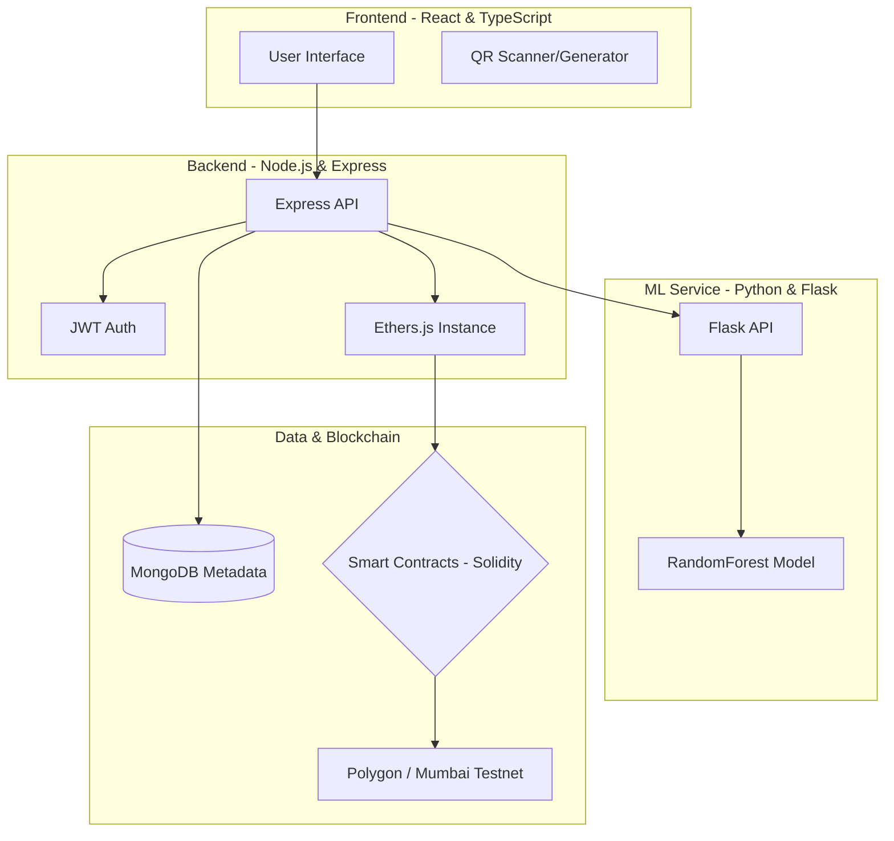
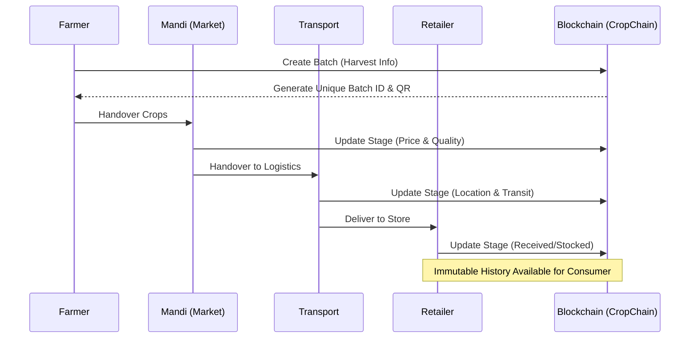

# CropChain - Blockchain Crop Supply Chain Tracker

<p align="center">
  
  
  
  
</p>
  
CropChain is a comprehensive full-stack web application that enables transparent tracking of crop supply chains using blockchain technology. From farm to fork, every step in the supply chain is recorded immutably, providing complete traceability and building trust between all stakeholders.

---

## Live Deployment

The system is live and deployed across production services:

* **Frontend Application (Vercel)**: [cropchain.sonusid.in](https://cropchain.sonusid.in)
* **Backend API (AWS)**: [cropapi.sonusid.in](https://cropapi.sonusid.in) (Health Status: [cropapi.sonusid.in/api/health](https://cropapi.sonusid.in/api/health))
* **Smart Contract (Sepolia Testnet)**: [`0x2c79F3f6b448270ADF667CA5d23d23feC4d15Fa4`](https://sepolia.etherscan.io/address/0x2c79F3f6b448270ADF667CA5d23d23feC4d15Fa4)

---

## Features

### Core Functionality
- **Complete Supply Chain Tracking**: Track crops through all stages - Farmer → Mandi (Market) → Transport → Retailer
- **Blockchain Integration**: Immutable record keeping using Ethereum/Polygon smart contracts
- **QR Code Generation**: Unique QR codes for each batch enabling instant verification
- **Multi-Role Support**: Different interfaces for farmers, markets, transporters, and retailers
- **Admin Dashboard**: Comprehensive monitoring and analytics for supply chain managers
- **AI-Powered Assistant**: Intelligent chatbot for crop tracking support and stakeholder guidance
- **Offline-First Architecture**: Work without internet - data syncs automatically when online

### User Experience
- **Beautiful, Modern UI**: Apple-level design aesthetics with smooth animations
- **Responsive Design**: Optimized for mobile, tablet, and desktop devices
- **Real-time Timeline**: Visual supply chain journey with status indicators
- **QR Code Scanner**: Simulate scanning QR codes for batch tracking
- **Search & Filter**: Easy batch lookup and filtering capabilities
- **Conversational AI**: Natural language interface for system guidance and batch queries
- **Offline Mode**: Create batches and updates without internet connectivity
- **Auto-Sync**: Changes automatically sync to blockchain when connection restored

---

## Architecture

### Frontend (Next.js + TypeScript)
- **Framework**: Next.js with TypeScript
- **Styling**: Tailwind CSS with custom design system
- **Routing**: Next.js App/Pages Router
- **Icons**: Lucide React for consistent iconography
- **State Management**: React hooks and context

### Backend (Node.js + Express)
- **Runtime**: Node.js with Express framework
- **Blockchain**: Ethers.js for smart contract interaction
- **QR Codes**: QRCode library for batch QR generation
- **Database**: MongoDB for metadata storage
- **Authentication**: JWT-based auth system
- **AI Integration**: Gemini (@google/generative-ai) for intelligent assistance

### ML Service (Python + Flask)
- **Runtime**: Python 3.11 with Flask framework
- **Model**: Scikit-learn RandomForest Classifier
- **Endpoints**: Health and Crop Quality Prediction
- **Security**: API Key authentication and Rate Limiting
- **Deployment**: Gunicorn WSGI HTTP Server

### Smart Contracts (Solidity)
- **Platform**: Ethereum/Polygon compatible
- **Language**: Solidity ^0.8.19
- **Features**: Batch creation, supply chain updates, access control
- **Security**: Role-based permissions and data validation

---

````md
## Docker Setup

### Prerequisites

Make sure the following are installed on your system:

- Docker 24+
- Docker Compose plugin (`docker compose`)

---

## Quick Start

### 1. Clone the Repository

```bash
git clone https://github.com/Nitya-003/CropChain.git
cd CropChain
````

### 2. Configure Environment Variables

Create a root `.env` file:

```bash
cp .env.example .env
```

Update the `.env` file with the required values:

```env
# Frontend public API endpoint
NEXT_PUBLIC_API_URL=http://localhost:3001

# Backend runtime
NODE_ENV=production
PORT=3001
MONGODB_URI=mongodb://db:27017/cropchain
FRONTEND_URL=http://localhost:3000
ALLOWED_ORIGINS=http://localhost:3000

# Blockchain configuration
INFURA_URL=https://polygon-mainnet.infura.io/v3/YOUR_PROJECT_ID
CONTRACT_ADDRESS=0xYOUR_CONTRACT_ADDRESS
PRIVATE_KEY=0xYOUR_PRIVATE_KEY
```

> **Note:** `NEXT_PUBLIC_*` variables are exposed to the browser and evaluated during build time.
> If you modify them later, rebuild the frontend image using:
>
> ```bash
> docker compose build frontend
> ```
>
> or
>
> ```bash
> docker compose up --build
> ```

---

## Start the Application Stack

Build and start all services:

```bash
docker compose up --build
```

This starts:

* Frontend (Next.js)
* Backend (Node.js + Express)
* ML Service (Python + Flask)
* MongoDB Database
* Hardhat Blockchain Node

---

## Access the Services

| Service      | URL                       |
| ------------ | ------------------------- |
| Frontend     | http://localhost:3000     |
| Backend API  | http://localhost:3001     |
| ML Service   | http://localhost:5001     |
| Hardhat Node | http://localhost:8545     |
| MongoDB      | mongodb://localhost:27017 |

---

## Deploy Smart Contracts

To deploy smart contracts to the running Hardhat container:

```bash
docker compose exec hardhat npx hardhat run scripts/deploy.js --network localhost
```

---

## Development Workflow

Docker Compose provides:

* Hot reloading for development
* Isolated and reproducible environments
* Internal container networking
* Persistent MongoDB storage
* Simplified multi-service orchestration

---

## Stop the Services

Stop all running containers:

```bash
docker compose down
```

Stop containers and remove volumes:

```bash
docker compose down -v
```

---

## Additional Notes

* The root `Dockerfile` uses a multi-stage build setup for optimized frontend and backend images.
* `.dockerignore` excludes unnecessary folders like `node_modules`, `dist`, `build`, and `.git` to reduce build size.
* To inspect built image sizes, run:

```bash
docker images
```

```
```


## Quick Start

### Prerequisites
- Node.js (v18.18+)
- npm or yarn
- MetaMask wallet
- Infura/Alchemy account (for blockchain)
- MongoDB (for production)

### Installation

1. **Clone the repository**
   ```bash
   git clone https://github.com/Siddh2024/CropChain.git
   cd CropChain
   ```

2. **Install dependencies**
   ```bash
   # Frontend
   npm install
   # Backend
   cd backend && npm install && cd ..
   ```

3. **Environment Setup**
   ```bash
   # Copy environment files
   cp backend/.env.example backend/.env
   cp .env.example .env
   
   # Edit with your configuration
   nano backend/.env
   nano .env
   ```

6. **Configure AI Chatbot** (Optional)
   ```bash
   # Add Gemini API key to backend/.env
   echo "GEMINI_API_KEY=your_gemini_api_key_here" >> backend/.env
   ```

### Development Setup

1. **Start Frontend Development Server**
   ```bash
   npm run dev
   ```

2. **Start Backend Server** (in separate terminal)
   ```bash
   cd backend
   npm run dev
   ```

3. **Deploy Smart Contracts** (optional, for blockchain integration)
   ```bash
   # For local development
   npx hardhat node
   npx hardhat run scripts/deploy.js --network localhost
   
   # For Mumbai testnet
   npx hardhat run scripts/deploy.js --network mumbai
   ```

### System Architecture

```mermaid
graph TD
    subgraph Client_Layer [Frontend - React & TypeScript]
        UI[User Interface]
        QR[QR Scanner/Generator]
    end

    subgraph Logic_Layer [Backend - Node.js & Express]
        API[Express API]
        JWT[JWT Auth]
        ETH[Ethers.js Instance]
    end

    subgraph ML_Layer [ML Service - Python & Flask]
        MLAPI[Flask API]
        RF[RandomForest Model]
    end

    subgraph Storage_Layer [Data & Blockchain]
        DB[(MongoDB Metadata)]
        BC{Smart Contracts - Solidity}
        Network[Polygon / Mumbai Testnet]
    end

    UI --> API
    API --> JWT
    API --> DB
    API --> ETH
    API --> MLAPI
    MLAPI --> RF
    ETH --> BC
    BC --> Network
```

### Supply Chain Lifecycle Flow

```mermaid
sequenceDiagram
    participant F as Farmer
    participant M as Mandi (Market)
    participant T as Transport
    participant R as Retailer
    participant B as Blockchain (CropChain)

    F->>B: Create Batch (Harvest Info)
    B-->>F: Generate Unique Batch ID & QR
    F->>M: Handover Crops
    M->>B: Update Stage (Price & Quality)
    M->>T: Handover to Logistics
    T->>B: Update Stage (Location & Transit)
    T->>R: Deliver to Store
    R->>B: Update Stage (Received/Stocked)
    Note over R,B: Immutable History Available for Consumer
```

---

## Usage

### For Farmers
1. Navigate to "Add Batch" page
2. Fill in crop details (type, quantity, harvest date, etc.)
3. Submit to create blockchain record and QR code
4. Share QR code with supply chain partners

### For Supply Chain Partners (Mandi, Transport, Retailers)
1. Go to "Update Batch" page
2. Search for batch using Batch ID
3. Add your stage information (actor, location, notes)
4. Submit update to blockchain

### For Consumers & Verification
1. Use "Track Batch" page
2. Scan QR code or enter Batch ID
3. View complete supply chain history
4. Verify authenticity and quality information

### For Administrators
1. Access Admin Dashboard
2. Monitor all batches and supply chain activity
3. View analytics and statistics
4. Manage system-wide operations

### AI Assistant Usage
1. **Access**: Click the floating chat button (bottom-right corner) on any page
2. **Quick Actions**: Use suggested buttons for common tasks
3. **Natural Queries**: Ask questions like:
   - "Where is batch CROP-2024-001?"
   - "How do I create a new batch?"
   - "What does immutable record mean?"
   - "Help me track my shipment"
4. **Context Awareness**: The AI understands your current page and provides relevant help
5. **Function Calling**: AI can search batches and provide real-time data

---

## Configuration

### Environment Variables

**Backend (.env)**
```env
# Server
PORT=3001
NODE_ENV=development

# Blockchain
INFURA_URL=https://polygon-mumbai.infura.io/v3/YOUR_PROJECT_ID
CONTRACT_ADDRESS=0x...
PRIVATE_KEY=0x...

# Database
MONGODB_URI=mongodb://localhost:27017/cropchain

# Security
JWT_SECRET=your_secret_key

# AI Chatbot (Optional)
GEMINI_API_KEY=your_gemini_api_key_here
AI_MODEL=gemini-1.5-flash
AI_MAX_TOKENS=500
AI_TEMPERATURE=0.7

# ML Service API Key
ML_API_KEY=your_ml_api_key_here
```

**Frontend (.env)**
```env
# API Configuration
NEXT_PUBLIC_API_URL=http://localhost:3001

# Development
NEXT_PUBLIC_DEV_MODE=true
```

**Smart Contracts (hardhat.config.js)**
```javascript
networks: {
  mumbai: {
    url: process.env.INFURA_URL,
    accounts: [process.env.PRIVATE_KEY]
  }
}
```
---

## Testing

### Frontend Tests
```bash
npx vitest
```

### Backend Tests
```bash
cd backend
npm test
```

### Smart Contract Tests
```bash
npx hardhat test
```
---

## Deployment

### Frontend Deployment (Netlify/Vercel)
```bash
npm run build
# Deploy dist/ folder to your hosting provider
```

### Backend Deployment (Heroku/Railway)
```bash
cd backend
# Configure environment variables on your platform
git push heroku main
```

### Smart Contract Deployment
```bash
# Mumbai Testnet
npx hardhat run scripts/deploy.js --network mumbai

# Polygon Mainnet
npx hardhat run scripts/deploy.js --network polygon
```
---

## Security Features

- **Access Control**: Role-based permissions in smart contracts
- **Data Validation**: Input sanitization and validation
- **Rate Limiting**: API rate limiting to prevent abuse
- **CORS Protection**: Configured CORS policies
- **Environment Variables**: Sensitive data protected via env vars
- **Smart Contract Auditing**: Comprehensive testing and validation

---

## Technology Stack

**Frontend**
- React 18 + TypeScript
- Tailwind CSS
- Next.js App/Pages Router
- Lucide React Icons
- QRCode.js
- Framer Motion (animations)

**Backend**
- Node.js + Express
- Ethers.js
- MongoDB + Mongoose
- JWT Authentication
- QRCode Generation
- Gemini API Integration
- Axios HTTP Client

**Machine Learning**
- Python 3.11
- Flask (API framework)
- Scikit-learn (RandomForest Model)
- Gunicorn (WSGI server)
- NumPy & Joblib

**Blockchain**
- Solidity ^0.8.19
- Hardhat Development Environment
- Ethereum/Polygon Networks
- OpenZeppelin Libraries

**DevOps**
- ESLint + Prettier
- Husky Git Hooks
- GitHub Actions CI/CD
- Docker Support

---

## Crop Lifecycle Progress Tracker

CropChain includes an interactive progress tracker representing the end-to-end journey of a crop batch from registration to final retailer delivery.

### Lifecycle Workflow
Every crop batch flows sequentially through the following 6 stages:
1. **Registered**: Initial creation of crop record.
2. **Growing**: Active cultivation phase in fields.
3. **Harvested**: Crops harvested and ready for processing.
4. **Quality Checked**: Certified safe and qualified by inspectors.
5. **Transported**: Loaded and shipped in cold-chain logistics.
6. **Delivered**: Received at final retailer destinations.

### State Transition Validation & Rules
- Transitions are strictly sequential (no skipping stages, no reverting backwards).
- Prevent duplicate updates and unauthorized role changes:
  - **Farmer**: Authorized to update stages until `Harvested` (`Growing`, `Harvested`).
  - **Distributor** (Transporter / Mandi): Authorized to update to `Transported`.
  - **Retailer**: Authorized to update to `Delivered`.
  - **Admin**: Full control over all transitions (including `Quality Checked`).

### REST API Documentation
- **Get Crop Lifecycle Details**: `GET /api/batches/:id/lifecycle`
  - Returns `currentStage`, `stageHistory`, and `completionPercentage`.
- **Update Lifecycle Stage**: `PATCH /api/batches/:id/lifecycle`
  - Body: `{ "stage": "Growing", "notes": "Growing smoothly" }`
  - Validates role authorizations and transitions.

### Premium Frontend Component
The tracker renders dynamically as the `CropLifecycleTracker` component:
- **Desktop**: Interactive horizontal progress bar with customized SVG and framer-motion micro-animations.
- **Mobile**: Responsive vertical timeline cards with action details.
- **Smart Features**:
  - *Delay Alert Detection*: Automatically warns if a batch remains in a stage longer than configurable expectations (e.g. `⚠ Transport pending for 6 days`).
  - *Relative Timestamps*: Displayed as "3 hours ago", "Yesterday", or "5 days ago".
  - *Tooltip cards*: Displays complete metadata, blockchain transaction links, and timestamps on hover/focus.

---

## Roadmap

### Phase 1 (Current)
- Basic supply chain tracking
- QR code generation and scanning
- Multi-role interfaces
- Admin dashboard
- AI-powered chatbot assistant
- Offline-first data logging with background sync

### Phase 2 (Next)
- Service Worker background sync
- Progressive Web App (PWA)
- IoT Sensor Integration
- Advanced analytics and reporting
- Mobile app development
- Multi-language support
- Enhanced AI capabilities (voice, image recognition)

### Phase 3 (Future)
- AI-powered quality prediction
- Carbon footprint tracking
- Marketplace integration
- Government compliance features
- Predictive supply chain analytics
- Offline image caching and compression

---

## Contributing

I welcome contributions! 

1. Fork the repository
2. Create your feature branch (`git checkout -b feature/AmazingFeature`)
3. Commit your changes (`git commit -m 'Add some AmazingFeature'`)
4. Push to the branch (`git push origin feature/AmazingFeature`)
5. Open a Pull Request

## License

This project is licensed under the Apache License 2.0 - see the [LICENSE](LICENSE) file for further details.

---

## Acknowledgments

- OpenZeppelin for smart contract libraries
- Infura/Alchemy for blockchain infrastructure
- The amazing open-source community
- Agricultural experts who provided domain knowledge

---

**Built with love for transparent agriculture and food safety**

*CropChain - Connecting farms to forks with blockchain transparency*
