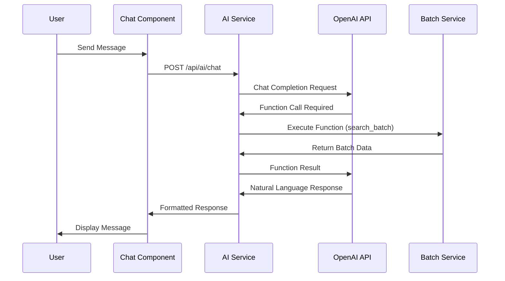

# CropChain AI Chatbot - Technical Documentation

## Overview

The CropChain AI Chatbot (CropAssistant) is an intelligent conversational interface that helps users navigate the supply chain tracking system, answer questions about blockchain concepts, and provide real-time batch information. Built with OpenAI's GPT-4o mini and featuring a glassmorphic design with smooth animations.

## Features

### Core Capabilities
- **Natural Language Processing**: Understands user queries in plain English
- **Function Calling**: Can search batches and retrieve real-time data
- **Context Awareness**: Adapts responses based on current page and user context
- **Fallback Mode**: Works without OpenAI API key using predefined responses
- **Real-time Chat**: Instant responses with typing indicators

### UI/UX Features
- **Glassmorphic Design**: Modern backdrop-blur effects with transparency
- **Smooth Animations**: Framer Motion powered transitions and micro-interactions
- **Responsive Interface**: Works seamlessly on mobile, tablet, and desktop
- **Quick Actions**: Contextual suggestion buttons for common tasks
- **Minimizable Chat**: Collapsible interface to save screen space

## Architecture

### Frontend Components

```
src/components/AIChatbot.tsx          # Main chat interface component
src/services/aiChatService.ts         # Frontend service for API communication
```

### Backend Services

```
backend/services/aiService.js         # OpenAI integration and function calling
backend/server.js                     # API route: POST /api/ai/chat
```

### Data Flow



## API Reference

### Chat Endpoint

**POST** `/api/ai/chat`

**Request Body:**
```json
{
  "message": "Where is batch CROP-2024-001?",
  "context": {
    "currentPage": "track-batch",
    "batchId": "CROP-2024-001",
    "userRole": "user"
  }
}
```

**Response:**
```json
{
  "success": true,
  "response": "Batch CROP-2024-001 is currently at the Transport stage in Mumbai. It was last updated by ABC Logistics on 2024-01-15.",
  "timestamp": "2024-01-15T10:30:00.000Z",
  "functionCalled": "search_batch",
  "functionResult": {
    "success": true,
    "data": {
      "batchId": "CROP-2024-001",
      "currentStage": "transport",
      "farmerName": "Rajesh Kumar",
      "cropType": "rice"
    }
  }
}
```

### Available Functions

#### 1. search_batch
Searches for a specific crop batch by ID.

**Parameters:**
- `batchId` (string): The batch ID to search for

**Returns:**
- Batch information including current stage, farmer details, and update count

#### 2. get_batch_stats
Retrieves overall system statistics.

**Parameters:** None

**Returns:**
- Total batches, farmers, quantity, and recent batch count

#### 3. explain_process
Provides explanations for CropChain processes.

**Parameters:**
- `topic` (string): The topic to explain

**Returns:**
- Detailed explanation of the requested process

## Configuration

### Environment Variables

**Backend (.env):**
```env
# Required for full AI functionality
OPENAI_API_KEY=your_openai_api_key_here

# Optional AI configuration
AI_MODEL=gpt-4o-mini
AI_MAX_TOKENS=500
AI_TEMPERATURE=0.7
```

**Frontend (.env):**
```env
# API endpoint for chat service
VITE_API_URL=http://localhost:3001
```

### OpenAI Setup

1. **Get API Key**: Sign up at [OpenAI Platform](https://platform.openai.com/)
2. **Add to Environment**: Set `OPENAI_API_KEY` in backend/.env
3. **Configure Model**: Adjust `AI_MODEL`, `AI_MAX_TOKENS`, and `AI_TEMPERATURE` as needed

### Fallback Mode

If no OpenAI API key is provided, the chatbot operates in fallback mode with predefined responses for common queries:

- Batch tracking guidance
- QR code explanations
- Supply chain process help
- General CropChain information

## Usage Examples

### Basic Queries
```
User: "How do I track a batch?"
AI: "To track a batch, you can either scan the QR code or search by batch ID (format: CROP-YYYY-XXX) on the Track Batch page. This will show you the complete supply chain journey."
```

### Batch Searches
```
User: "Where is batch CROP-2024-001?"
AI: "Batch CROP-2024-001 is currently at the Mandi stage in Punjab. It contains 1000 kg of rice from farmer Rajesh Kumar, harvested on 2024-01-15."
```

### Process Explanations
```
User: "What is an immutable record?"
AI: "An immutable record means the data cannot be changed or deleted once written to the blockchain. This ensures the integrity of crop tracking information and builds trust among farmers, retailers, and consumers."
```

### Context-Aware Responses
```
# On Add Batch page
User: "Help me"
AI: "I can help you create a new batch! Fill in the farmer details, crop type, quantity, and harvest date. The system will generate a unique batch ID and QR code for tracking."
```

## Customization

### Adding New Functions

1. **Define Function in aiService.js:**
```javascript
{
  name: 'get_weather_data',
  description: 'Get weather information for crop locations',
  parameters: {
    type: 'object',
    properties: {
      location: { type: 'string', description: 'Location name' }
    },
    required: ['location']
  }
}
```

2. **Implement Function Logic:**
```javascript
case 'get_weather_data':
  const weatherData = await weatherService.getWeather(parameters.location);
  return { success: true, data: weatherData };
```

### Customizing Quick Actions

Modify `getQuickActions()` in `aiChatService.ts`:

```typescript
getQuickActions(context?: ChatContext): Array<{ label: string; message: string; icon: string }> {
  const actions = [
    {
      label: 'Weather Info',
      message: 'What\'s the weather like for farming?',
      icon: '🌤️'
    }
  ];
  
  // Add context-specific actions
  if (context?.currentPage === 'add-batch') {
    actions.unshift({
      label: 'Optimal Harvest Time',
      message: 'When is the best time to harvest?',
      icon: '⏰'
    });
  }
  
  return actions;
}
```

### Styling Customization

The chatbot uses Tailwind CSS classes. Key customization points:

```tsx
// Chat window background
className="bg-white/95 dark:bg-gray-900/95 backdrop-blur-xl"

// Message bubbles
className="bg-blue-500 text-white" // User messages
className="bg-white dark:bg-gray-800" // AI messages

// Floating action button
className="bg-gradient-to-r from-green-500 to-green-600"
```

## Security Considerations

### API Key Protection
- Store OpenAI API key in environment variables only
- Never expose API keys in frontend code
- Use server-side proxy for all OpenAI requests

### Input Validation
- Message length limited to 1000 characters
- Input sanitization via Zod schemas
- Rate limiting applied to chat endpoint

### Data Privacy
- No sensitive user data sent to OpenAI
- Batch information filtered before function calls
- Chat history stored locally in browser only

## Performance Optimization

### Response Caching
Consider implementing response caching for common queries:

```javascript
const responseCache = new Map();

async chat(message, batchService) {
  const cacheKey = message.toLowerCase().trim();
  
  if (responseCache.has(cacheKey)) {
    return responseCache.get(cacheKey);
  }
  
  const response = await this.callOpenAI(message, batchService);
  responseCache.set(cacheKey, response);
  
  return response;
}
```

### Lazy Loading
The chatbot component is loaded only when needed:

```tsx
const AIChatbot = React.lazy(() => import('./components/AIChatbot'));

// In App.tsx
<Suspense fallback={<div>Loading chat...</div>}>
  <AIChatbot />
</Suspense>
```

## Troubleshooting

### Common Issues

**1. Chat not responding**
- Check OpenAI API key in backend/.env
- Verify backend server is running
- Check browser console for errors

**2. Function calls failing**
- Ensure batch service is properly connected
- Check function parameter validation
- Verify database connectivity

**3. Animations not working**
- Confirm framer-motion is installed
- Check for CSS conflicts
- Verify browser supports backdrop-filter

### Debug Mode

Enable debug logging:

```javascript
// In aiService.js
console.log('AI Request:', { message, context });
console.log('OpenAI Response:', response.data);
console.log('Function Result:', functionResult);
```

## Testing

### Unit Tests
```bash
# Frontend tests
npm test -- --testPathPattern=AIChatbot

# Backend tests
cd backend
npm test -- --testPathPattern=aiService
```

### Manual Testing Checklist
- [ ] Chat opens/closes smoothly
- [ ] Messages send and receive correctly
- [ ] Quick actions work
- [ ] Function calling retrieves batch data
- [ ] Fallback mode works without API key
- [ ] Responsive design on mobile
- [ ] Dark mode compatibility
- [ ] Typing indicators display
- [ ] Error handling works

## Future Enhancements

### Planned Features
- **Voice Input**: Speech-to-text integration
- **Image Recognition**: QR code scanning via camera
- **Multi-language**: Support for regional languages
- **Offline Mode**: Cached responses for common queries
- **Analytics**: Chat interaction tracking and insights

### Integration Opportunities
- **IoT Sensors**: Real-time environmental data queries
- **Weather APIs**: Crop-specific weather information
- **Market Prices**: Current commodity pricing data
- **Government APIs**: Compliance and certification status

---

**Built with ❤️ for intelligent crop tracking assistance**